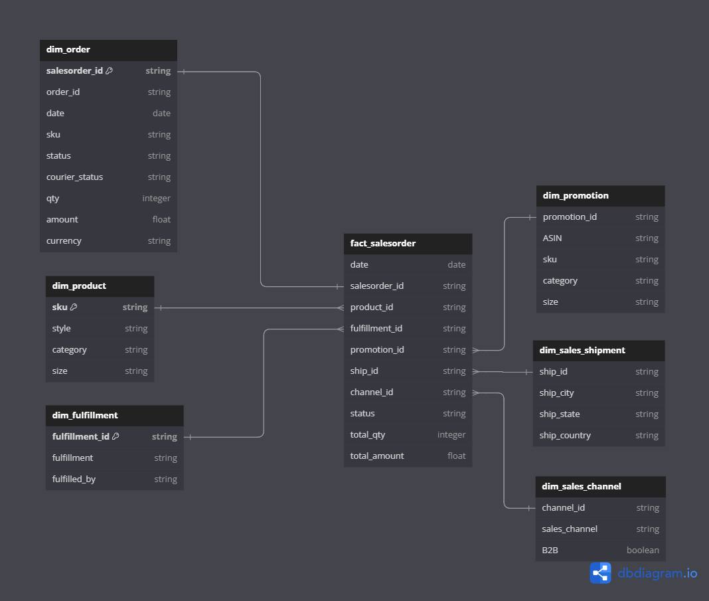
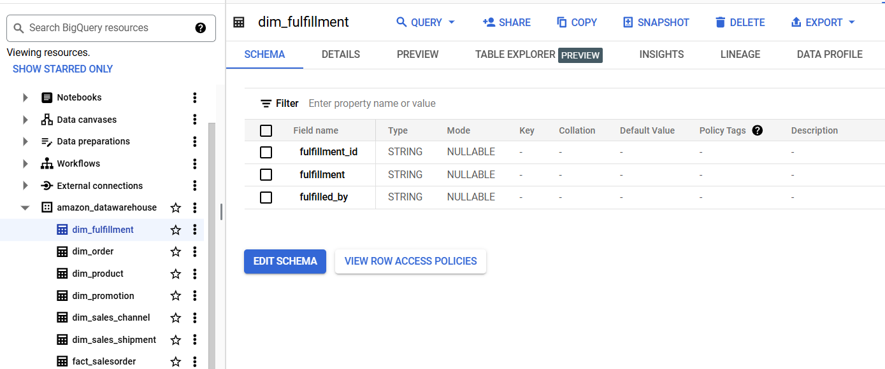
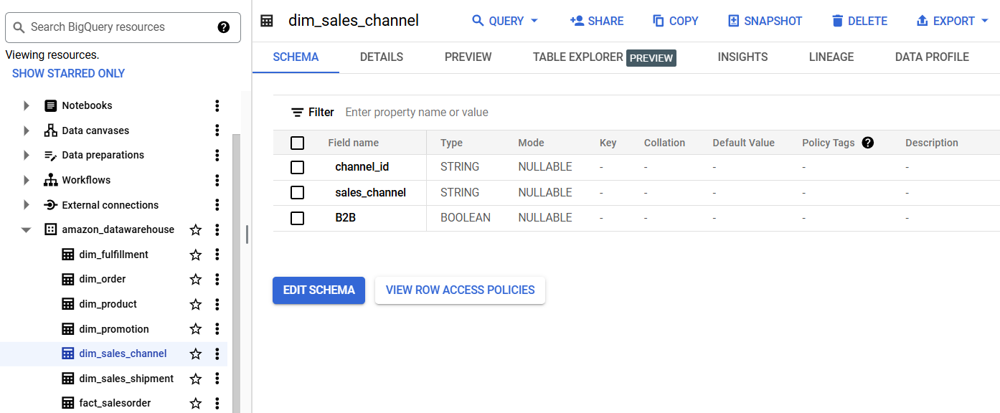
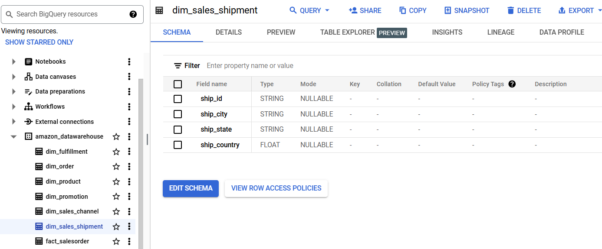
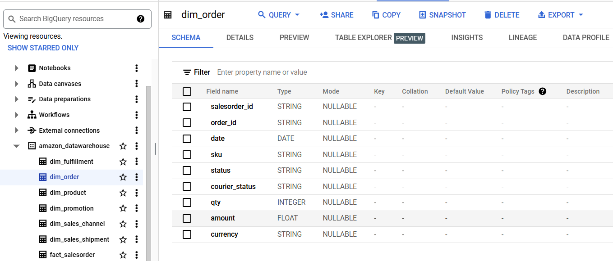
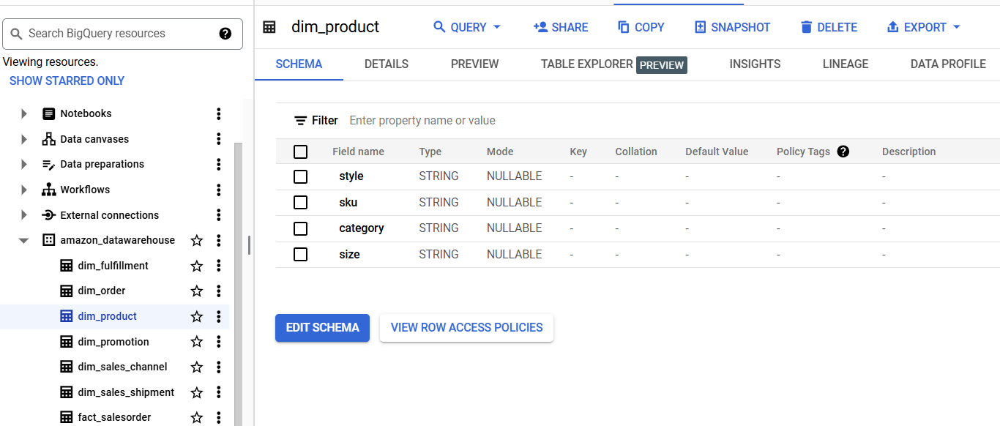
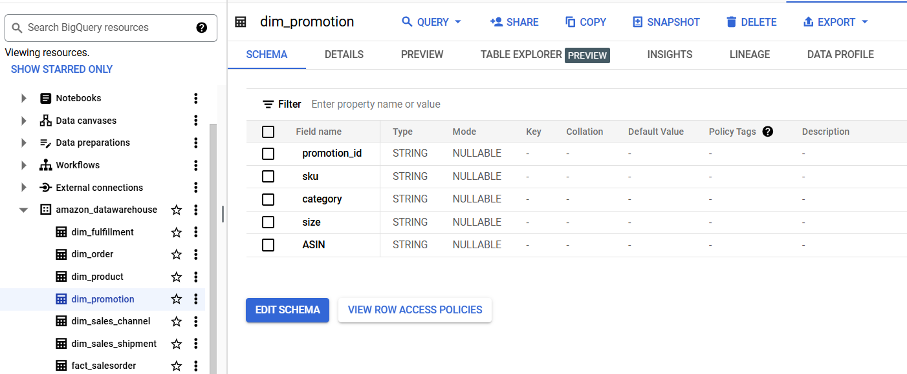
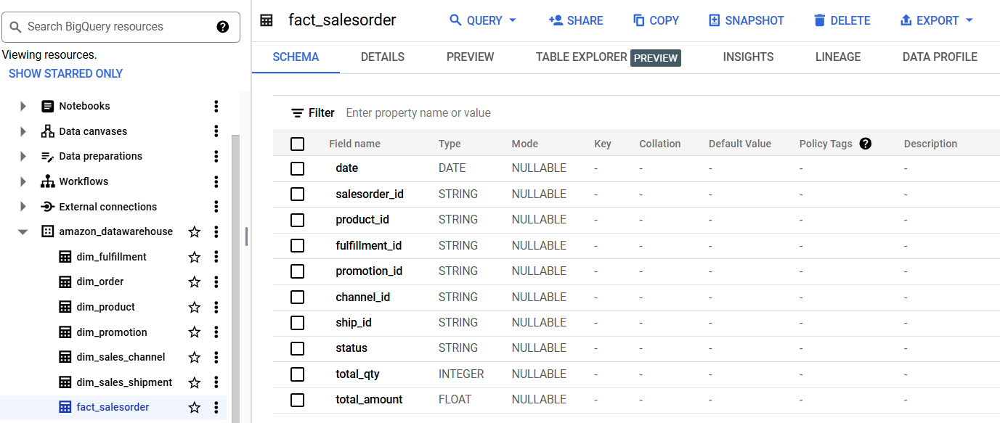

# amazon-datawarehouse
## Objective
This project aims to optimize the extraction, transformation, and analysis of transactional data for a rapidly growing e-commerce platform. It involves building data pipeline capable of handling large volumes of transactional information, ensuring the data is accurate, structured for insightful analysis.

## Tools

- Cloud Storage: Data will be stored and managed in Google Cloud Storage, which will act as a centralized repository for raw data before being processed.
- BigQuery: Data will be loaded into BigQuery for further analysis and querying.
- DBT: The transformation layer will be handled by DBT, ensuring that all necessary data transformations (such as cleaning, aggregating, and joining) are performed efficiently and accurately

## ERD


## Dimensional Table
- dim_fulfillment<br><br/><br><br/>
- dim_channel<br><br/><br><br/>
- dim_ship<br><br/><br><br/>
- dim_order<br><br/><br><br/>
- dim_product<br><br/><br><br/>
- dim_promotion<br><br/><br><br/>

## Fact Table
- fact_salesorder<br><br/><br><br/>

notes: got some issue while upload amazon-datawarehouse folder, i upload it on other github repository<br>
[Amazon Datawarehouse Folder](https://github.com/fajri-yanti/amazon-datawarehouse)

## Top 10 Best Selling Product
<br><br><br/>

<details>
<summary>SQL Query Top 10 Best Selling Product</summary>

```sql
SELECT 
    o.sku AS product_id, 
    p.category,
    SUM(o.qty) AS qty_product 
    
FROM 
    `amazon-datawarehouse.amazon_datawarehouse.dim_order` o
LEFT JOIN 
    `amazon-datawarehouse.amazon_datawarehouse.dim_product` p
ON 
    o.sku = p.sku
GROUP BY 
    o.sku, p.category
ORDER BY 
    qty_product DESC
LIMIT 10;
```
</details>

